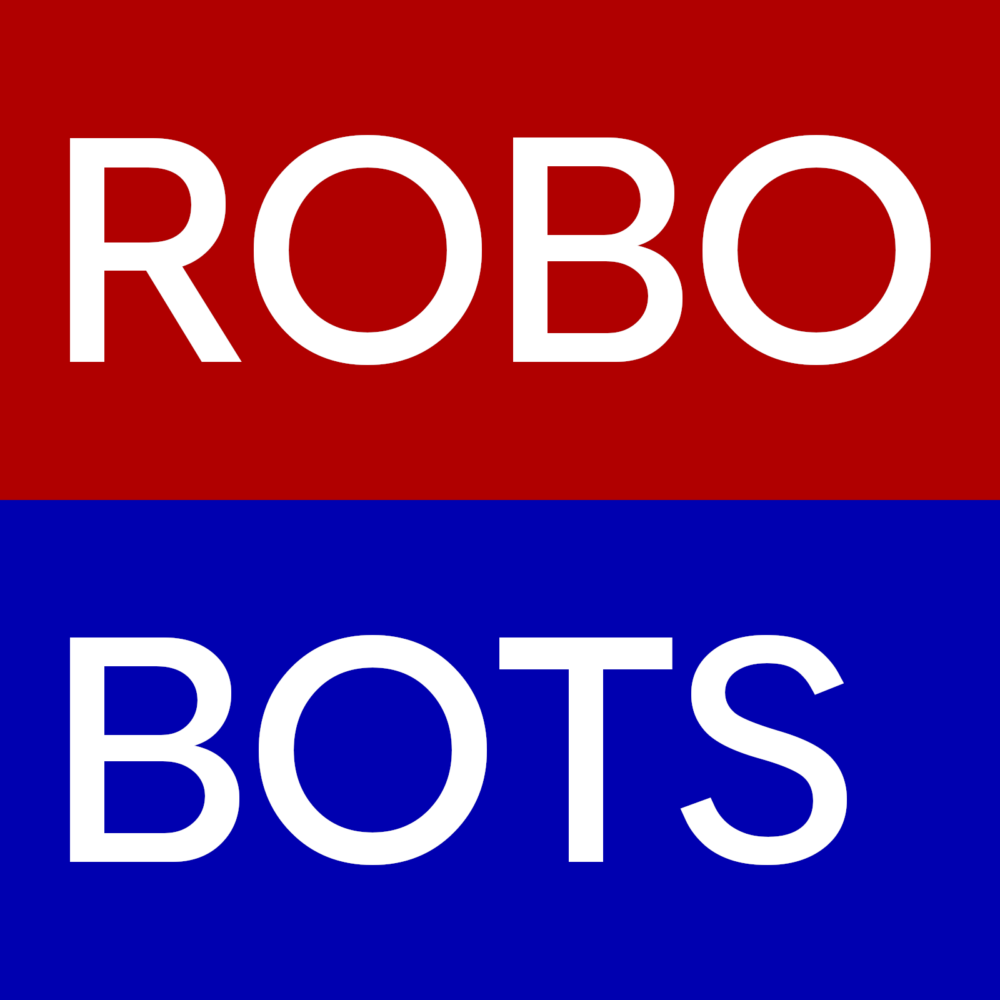

# Branding

## Team Name
The name of the team is "The Robobots". In written form the team may be referred to as follows:
- The Robobots
- Team 9140
- 9140
- Team 9140: The Robobots

The team may not be referred to in any way not included above. Incorrect examples are as follows:
- The RoboBots
- RoboBots
- The Robo Bots
- Robo Bots
- robobots

## Team Colors

In print and digital media the following colors should be used. Other materials will have suitable products specified in a later section.

Primary Red: #b00000
- RGB 176, 0, 0
- CMYK 0, 100, 100, 31

Primary Blue: #0000b0
- RGB 0, 0, 176
- CMYK 100, 100, 0, 31

Primary White: #ffffff
- RGB 255, 255, 255
- CMYK 0, 0, 0, 0

Primary Black: #181818
- RGB 24, 24, 24
- CMYK 0, 0, 0, 91

## Team Logo

The team logo is comprised of Primary Red and Primary Blue fields with the words ROBO and BOTS overlaid in Google Sans Flex Medium font. The color logo may be used on white, black, or grey solid backgrounds only. An exception is the FMS avatar which may be displayed on other backgrounds by third-party systems. A clear space of one quarter the height of the red field must be maintained on all sides.

square:

wide:

FMS avatar:

In situations where the logo can not be displayed in color, the alternate greyscale logo robobots_logo_square_mono.png should be used. The color logo should not be converted.

## Fonts

The Team Name should be displayed in Google Sans Flex Medium wherever possible. Text in any other written materials should be Arial or a comparable non-serif font.

## Substitute colors for non-print materials

It is not feasible to use Primary Red and Primary Blue in all materials. Only the following materials should be used to maintain as consistent an appearance as possible.

### Paint

Painting robot parts is a waste of time. Steel may be painted to prevent rust. Preferred powdercoat colors are [Ultramarine Blue](https://www.prismaticpowders.com/shop/powder-coating-colors/PSS-2873/ultramarine-blue) PSS 2873 and [Bullseye](https://www.prismaticpowders.com/shop/powder-coating-colors/PMB-3078/bullseye) PMB 3078 from Prismatic Powders. No parts should be painted any other colors.

### 3D Printer Filament

PLA parts printed in red or blue should use eSUN PLA+ in [blue](https://esun3dstore.com/products/pla-refilament?VariantsId=12621) and [fire engine red](https://esun3dstore.com/products/pla-refilament?VariantsId=12617). Any black may be used. TPU parts must be any light grey. Any white may be used for lettering only. No other colors may be used on competition robots. Other colors are acceptable for prototypes or tool organization.

### Fabric

### Shirts

